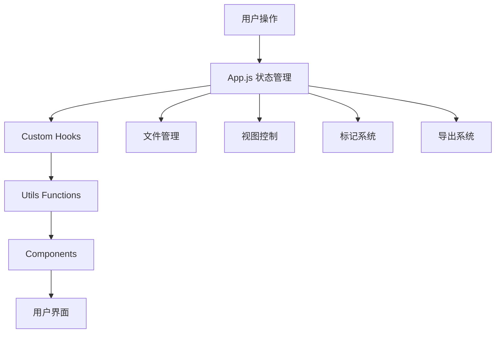

# Lyra's Exporter - AI对话导出器 🚀

> **专业的AI对话导出器** - 支持Claude、Gemini、NotebookLM等多平台对话记录的统一管理和导出

---

## 核心功能

### 📁 多平台支持
- **Claude**: 支持单对话和完整账号导出格式
- **Gemini**: 支持Gemini和Google AI Studio导出
- **NotebookLM**: 完整的笔记本对话支持
- 自动格式检测和智能解析

### 🎯 强大功能
- ✉️ **全功能读取**: 对话内容、图片、附件、思考过程、Artifacts 多格式信息展现
- 🏷️ **标记系统**: 标记消息为完成、重要或删除
- 🌲 **分支检测**: 自动识别和导航对话分支
- 🔍 **智能查找**: 对于 Claude_all_conversation 具有强大的筛选功能，收藏标记，自由管理
- 📤 **批量导出**: 支持Markdown格式，可批量导出多个对话

## 🏗️ 项目架构

### 📂 目录结构

```

lyra-exporter/
├── src/
│   ├── App.js                 # 主应用入口
│   ├── components/            # UI组件

│   │   ├── ConversationTimeline.js    # 时间线视图
│   │   ├── FullExportCardFilter.js    # 筛选器组件
│   │   ├── MessageDetail.js           # 消息详情模态框
│   │   ├── SettingsManager.js         # 设置管理器
│   │   └── UnifiedCard.js             # 统一卡片视图
│   ├── hooks/                 # 自定义Hook
│   │   ├── useFileManager.js          # 文件管理逻辑
│   │   └── useFullExportCardFilter.js # 筛选器逻辑
│   ├── utils/                 # 工具函数
│   │   ├── commonUtils.js             # 通用工具
│   │   ├── dataManager.js             # 数据管理
│   │   ├── exportManager.js           # 导出管理
│   │   ├── markManager.js             # 标记管理
│   │   ├── searchManager.js           # 搜索管理
│   │   ├── sortManager.js             # 排序管理
│   │   ├── starManager.js             # 星标管理
│   │   └── uuidManager.js             # UUID管理
│   └── styles/                # 样式文件

│       ├── index.css                  # 主入口样式
│       ├── variables.css              # CSS变量和主题
│       ├── reset.css                  # 全局重置
│       ├── components.css             # 通用组件
│       ├── app.css                    # App布局
│       ├── export.css                 # 导出面板
│       ├── cards-timeline.css         # 卡片和时间线
│       ├── message-detail.css         # 消息详情
│       ├── filters-settings.css       # 筛选器和设置
│       └── responsive.css             # 响应式设计
├── public/
│   └── index.html
├── package.json
└── README.md
```

### 🔄 数据流架构



## 🛠️ 技术栈

- **前端框架**: React 18.2
- **状态管理**: React Hooks (useState, useEffect, useMemo, useCallback)
- **样式方案**: 模块化CSS + CSS变量
- **文件处理**: File API + Blob
- **数据存储**: localStorage
- **国际化**: 自定义i18n实现

---

## 🔧 核心工具函数 (utils/)

### `fileParser.js` - 数据解析引擎

#### **格式检测**

**`detectFileFormat(jsonData)`**
- **功能**: 自动检测JSON文件格式类型
- **支持格式**:
  - `gemini_notebooklm`: Gemini/NotebookLM导出格式
  - `claude_full_export`: Claude完整导出格式
  - `claude`: Claude单个对话格式
  - `unknown`: 未知格式
- **返回**: 格式字符串标识

#### **主解析入口**

**`extractChatData(jsonData, fileName)`**
- **功能**: 统一的数据解析入口
- **流程**: 格式检测 → 调用对应解析器 → 返回标准化数据
- **返回**: 标准化的对话数据结构

#### **Claude格式解析器**

**`extractClaudeData(jsonData)`**
- **功能**: 解析Claude单个对话格式
- **处理内容**:
  - 消息内容(text/image/thinking)
  - 工具使用记录(tool_use/tool_result)
  - Artifacts内容
  - 引用信息(citations)
  - 附件图片
- **返回**: 包含meta_info和chat_history的数据结构

#### **Gemini/NotebookLM解析器**

**`extractGeminiNotebookLMData(jsonData, fileName)`**
- **功能**: 解析Gemini/NotebookLM导出格式
- **特性**:
  - 支持human/assistant对话对
  - 图片内容处理(base64格式)
  - 平台识别(gemini/notebooklm/aistudio)
- **返回**: 统一格式的对话数据

#### **Claude完整导出解析器**

**`extractClaudeFullExportData(jsonData, fileName)`**
- **功能**: 解析Claude完整导出格式(包含多个对话)
- **特性**:
  - 多对话管理
  - 项目分组
  - 对话头部标记
  - 星标状态
- **返回**: 包含views(conversations/projects)的扩展数据结构

#### **分支检测**

**`detectBranches(processedData)`**
- **功能**: 检测消息分支和分支点
- **算法**: 构建父子关系图 → 标记分支点 → 标记分支路径
- **返回**: 添加branches和branch_points的增强数据

#### **辅助工具函数**
- `parseTimestamp(timestampStr)`: 解析时间戳为本地化字符串
- `formatFileSize(bytes)`: 格式化文件大小显示
- `getImageDisplayData(imageInfo)`: 获取图片显示数据
- `createMessage()`: 创建标准消息对象
- `processContentArray()`: 处理content数组
- `processMessageImages()`: 处理消息中的图片
- `processGeminiImage()`: 处理Gemini格式图片
- `finalizeDisplayText()`: 生成最终显示文本
- `extractArtifact()`: 提取artifact信息
- `extractToolUse()`: 提取工具使用信息
- `extractToolResult()`: 提取工具结果信息
- `markBranchPath()`: 标记分支路径
- `extractBranchInfo()`: 提取分支信息

### `exportModule.js` - 导出管理模块

#### **Markdown生成**

**`exportChatAsMarkdown(processedData, config)`**

- **功能**: 将处理后的数据导出为Markdown格式
- **配置选项**:
  - `exportObsidianMetadata`: Obsidian元数据支持
  - `exportMarkedOnly`: 仅导出已标记消息
  - `includeTimestamps`: 包含时间戳
  - `includeThinking`: 包含思考过程
  - `includeArtifacts`: 包含Artifacts
  - `includeTools`: 包含工具使用
  - `includeCitations`: 包含引用
  - `obsidianProperties`: 自定义Obsidian属性
  - `obsidianTags`: Obsidian标签
- **特性**: 支持分支标记、详情折叠、表格格式

#### **文件保存**

**`saveTextFile(text, fileName)`**
- **功能**: 保存文本到文件
- **实现**: Blob + URL.createObjectURL
- **返回**: 成功/失败布尔值

#### **导出处理函数**

**`handleExport(exportOptions, ...params)`**
- **功能**: 统一的导出处理入口
- **参数**:
  - `exportOptions`: 导出选项配置
  - `viewMode`: 当前视图模式
  - `processedData`: 处理后的数据
  - `currentFile`: 当前文件
  - `sortedMessages`: 排序后的消息
  - `hasCustomSort`: 是否有自定义排序
  - `marks`: 标记数据
  - `operatedFiles`: 操作过的文件集合
  - `files`: 所有文件列表
  - `currentFileIndex`: 当前文件索引
- **导出范围**:
  - `current`: 当前时间线文件
  - `operated`: 有过操作的文件
  - `all`: 所有加载的文件
- **流程**: 数据收集 → 筛选过滤 → 生成Markdown → 保存文件

#### **内部处理函数**
- `exportCurrentFile()`: 导出当前文件
- `exportOperatedFiles()`: 导出操作过的文件
- `exportAllFiles()`: 导出所有文件
- `generateMarkdownContent()`: 生成Markdown内容
- `getFileMarks()`: 获取文件标记数据
- `getCurrentDate()`: 获取当前日期
- `getCurrentDateTime()`: 获取当前时间

### `constants.js` - 常量配置中心

- `SORT_OPTIONS`: 排序选项
- `MESSAGE_ACTIONS`: 消息操作类型

#### **标记和视图类型**
- `MARK_TYPES`: 标记类型(completed/important/deleted)
- `VIEW_MODES`: 视图模式(conversations/timeline)
- `FILE_FORMATS`: 文件格式标识
- `PLATFORMS`: 平台类型标识
- `SENDER_TYPES`: 发送者类型
- `TAB_TYPES`: 标签页类型

#### **存储配置**
- `STORAGE_KEYS`: localStorage键名配置
- `DEFAULT_EXPORT_CONFIG`: 导出默认配置
- `FILTER_DEFAULTS`: 筛选器默认值
- `DATE_RANGE_OPTIONS`: 日期范围选项
- `STARRED_FILTER_OPTIONS`: 星标筛选选项

### `messageHandler.js` - 消息处理器

**`createPostMessageHandler(fileActions, setError)`**
- **功能**: 创建postMessage事件处理器
- **支持消息类型**:
  - `LYRA_HANDSHAKE`: 握手确认
  - `LYRA_LOAD_DATA`: 加载数据
  - `LYRA_ERROR`: 错误处理
- **安全性**: 验证消息来源白名单

### `statsCalculator.js` - 统计计算器

**`getAllMarksStats(files, processedData, currentFileIndex)`**

- **功能**: 计算所有文件的标记统计

**`calculateViewStats(viewMode, ...params)`**
- **功能**: 根据视图模式计算统计数据

**`getSearchResultStats(viewMode, filteredMessages, ...params)`**
- **功能**: 获取搜索结果统计

---

## 🎨 UI组件层 (components/)

### 核心视图组件

**`UnifiedCard.js`**

- **功能**: 卡片网格视图(文件卡片/对话卡片)
- **特性**: 星标切换、文件管理、卡片选择

**`ConversationTimeline.js`**

- **功能**: 消息时间线视图
- **特性**: 消息标记、排序、分支显示、搜索高亮

**`FullExportCardFilter.js`**

- **功能**: 对话筛选器(仅claude_full_export格式)
- **特性**: 多维度筛选、实时统计

**`MessageDetail.js`**

- **功能**: 消息详情模态框
- **特性**: 标签页切换(内容/思考/Artifacts/JSON)

---

## 🚀 主应用逻辑 (App.js)

### **状态管理**

#### **文件相关状态**
- `files`: 文件列表
- `currentFile`: 当前文件
- `currentFileIndex`: 当前文件索引
- `processedData`: 处理后的数据
- `fileMetadata`: 文件元数据
- `operatedFiles`: 操作过的文件集合

#### **视图相关状态**
- `viewMode`: 视图模式(conversations/timeline)
- `selectedFileIndex`: 选中的文件索引
- `selectedConversationUuid`: 选中的对话UUID
- `selectedMessageIndex`: 选中的消息索引
- `showMessageDetail`: 是否显示消息详情
- `activeTab`: 激活的标签页

#### **导出相关状态**
- `showExportPanel`: 是否显示导出面板
- `exportOptions`: 导出选项配置

#### **其他状态**
- `scrollPositions`: 滚动位置记录
- `error`: 错误信息

### **核心功能处理**

#### **文件处理**
**`handleFileLoad(e)`**
- **功能**: 处理文件选择
- **调用**: fileActions.loadFiles()

**`handleFileRemove(fileIndex)`**
- **功能**: 移除文件
- **副作用**: 重置视图状态

#### **视图切换**
**`handleCardSelect(card)`**
- **功能**: 处理卡片选择
- **逻辑**:
  - 文件卡片 → 判断格式 → 切换视图
  - 对话卡片 → 设置对话UUID → 进入时间线

**`handleBackToConversations()`**
- **功能**: 返回对话列表
- **特性**: 恢复滚动位置

#### **标记和星标**
**`handleMarkToggle(messageIndex, markType)`**
- **功能**: 切换消息标记
- **副作用**: 添加到operatedFiles

**`handleStarToggle(conversationUuid, nativeIsStarred)`**
- **功能**: 切换星标状态(仅claude_full_export)

#### **导出功能**
**`handleExport()`**
- **功能**: 执行导出操作
- **调用**: exportHandler()
- **参数**: 传递所有必要的状态数据

#### **消息处理**
**`handlePostMessage`**
- **功能**: 处理跨窗口消息
- **使用**: createPostMessageHandler创建

**`handleMessageSelect(messageIndex)`**
- **功能**: 选择消息显示详情

### **计算属性**

**`allCards`** (useMemo)
- **功能**: 生成所有卡片数据
- **逻辑**: 根据viewMode和格式生成文件卡片或对话卡片

**`timelineMessages`** (useMemo)
- **功能**: 获取时间线消息
- **过滤**: 根据selectedConversationUuid过滤

**`currentConversation`** (useMemo)
- **功能**: 获取当前对话信息
- **增强**: 包含星标状态

**`searchTarget`** (useMemo)
- **功能**: 确定搜索目标数据
- **逻辑**: 根据视图模式返回卡片或消息

### **辅助功能**

**`getStats()`**
- **功能**: 获取统计数据
- **调用**: calculateViewStats()

**`getSearchPlaceholder()`**
- **功能**: 动态生成搜索框占位符
- **逻辑**: 根据视图和格式返回不同提示

### **副作用处理**

**主题初始化** (useEffect)

- 从localStorage读取主题设置
- 应用到document.documentElement

**PostMessage监听** (useEffect)
- 监听window.message事件
- 处理外部数据加载请求

**文件自动切换视图** (useEffect)
- 检测新加载文件格式
- 自动切换到合适的视图模式

---
## 📖 使用指南

### 1. 加载对话文件

支持三种方式：
- 点击"加载文件"按钮
- 拖拽文件到上传区域
- 通过postMessage API加载

### 2. 视图模式

- **文件视图**: 显示所有加载的文件
- **对话视图**: 显示对话列表（claude_full_export）
- **时间线视图**: 显示消息时间线

### 3. 搜索和筛选

- 实时搜索支持消息内容、图片、思考过程
- 高级筛选器支持项目、日期、星标筛选

### 4. 标记和管理

- 单击标记按钮切换标记状态
- 支持批量标记操作
- 标记数据自动保存到localStorage

### 5. 导出对话

导出范围选项：
- **当前文件**: 仅导出当前查看的文件
- **操作过的文件**: 导出所有标记或星标过的文件
- **所有文件**: 导出全部加载的文件

---

## 🔒 安全性设计

1. **消息来源验证**: postMessage白名单机制
2. **文件大小限制**: 最大100MB单文件限制
3. **文件类型验证**: 仅支持JSON格式
4. **XSS防护**: 所有用户内容经过安全处理
5. **本地存储隔离**: UUID作为存储键前缀

---

## 🎯 设计模式

### 1. 格式驱动UI适配
根据数据格式自动选择合适的UI模式和功能集

### 2. 统一UUID管理
文件、对话、消息使用统一的UUID标识系统

### 3. 分层数据处理
原始数据 → 格式检测 → 特定解析 → 标准化结构

### 4. 响应式设计
- 移动优先设计理念
- 触摸手势支持
- PWA就绪

---

## 📱 响应式支持

- 📱 **手机** (< 768px): 单列布局，优化触摸
- 📱 **平板** (768px - 1024px): 自适应网格
- 💻 **桌面** (> 1024px): 完整功能布局

---

## ♿ 无障碍特性

- 键盘导航支持
- ARIA标签
- 高对比度模式
- 减少动画选项

---

## 快速构建

```bash
# 安装依赖
npm install

# 启动开发服务器
npm start
```


## 🤝 贡献指南

欢迎提交Issue和Pull Request！

### 开发规范

1. 遵循ESLint配置
2. 提交前运行测试
3. 保持代码注释完整
4. 遵循组件命名规范

MIT License